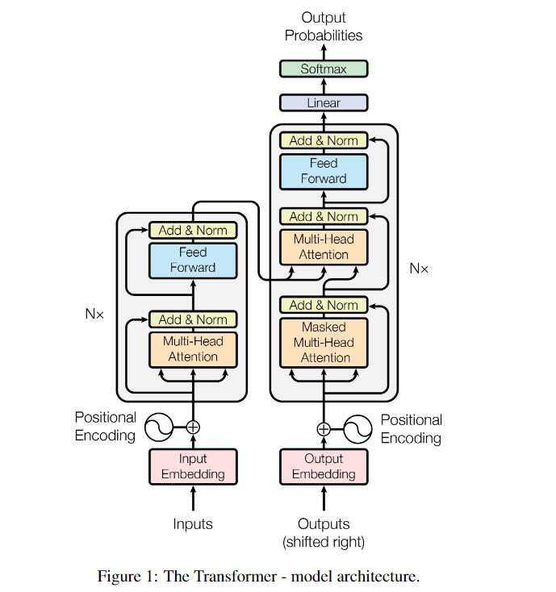

# Attention is All You Need

最近 Attention 出现频率已经非常高了，也是有必要去学习一下的。学习过后发现其实，可能未来真的是 `Attention is All You Need` 了。

大部分学习的内容来自李宏毅老师的视频课程，见 Reference 3,4。

## 写在前面

其实注意力机制只是整个神经网络中的一个 Module，并且有着异常多的变种，像残差网络一样，每个方法其实都不复杂三言两语就能介绍完，但是想要深入理解他的设计和实现之类的原理性问题，其实还是非常奇妙的。

## 注意力机制

可能谈起注意力机制，就要从 《Attention is All You Need》 开始，虽然他并不是第一个提出 Attention 这类概念的，但确实是他开始把 Attention 发扬光大的，包括里面的 Transformer 和 后面出现的 Bert。

### Scaled Dot-Product Attention

关于 Attention（这个在原文里称作"Scaled Dot-Product Attention"），其实只有一个最关键的公式：

$$
Attention(Q, K, V) = softmax(\frac{QK^T}{\sqrt{d_k}}) V
$$

$Q$ 和 $K$ 分别是 Query 和 Key，$V$ 是 Value，$d_k$ 是 Key 的维度，$\sqrt{d_k}$ 是 Key 的标准化因子，所以称为 Scaled。 Scaled 的目的也就是让 Key 和 Query 点积的结果不太大

### Multi-Head Attention

$$
MultiHeadAttention(Q, K, V) = Concat(head_1, ..., head_h)W^O \\
\text{where } head_i = Attention(QW_i^Q, KW_i^K, VW_i^V)
$$

其实可以把 MultiHeadAttention 看做成卷积里的多个卷积核，起到一样的作用。

### Position-wise Feed-Forward Networks

$$
FFN(x) = max(0, xW_1 + b_1)W_2 + b_2
$$

这个说白了就是一个全连接层，两个 Linear 中间加一个 ReLU，输入维度和输出维度是一样的，就中间的隐层是不同的。

### Embeddings and Softmax

这里也是一个 Scale 操作，防止数值过小，所以乘上了一个 $\sqrt{d_{model}}$。

### Positional Encoding

$$
PE_{pos, 2i} = sin(pos / 10000^{2i / d_model}) \\
PE_{pos, 2i + 1} = cos(pos / 10000^{2i / d_model})
$$

做这个的原因是为了让 Attention 获得一个位置信息，这样可以让网络更好地处理不同的位置信息。做法也只是把 Position Encoding 相加而已。

### Masked Attention

这一步是为了让输出的时候不看到后面的序列，方法就是把 QK 以后的值设置一个极小值，比如 -1e9，然后 Softmax 的时候就会很接近 0，因此也就起到了 Mask 的作用。

### Transformer

到这里，基本 Transformer 的 Module 都讲完了，剩下的就是把这些模块连起来，形成下面的结构

可以看到 Transformer Encoder 模块用到的 Attention 的三个输入均是 X，所以也叫自注意力（Self-Attention）。在 Decoder 中，两个输入来自 Encoder，另一个来自 Embedding。

值得一提的是，其实 Transformer 可以看成是 CNN 的加强版，因为 CNN 由于卷积核的存在，相当于值关注于卷积核内的区域，而 Transformer 则是关注全局内容。CNN 通过下采样获得更大的感受野之后，才能达到 Transformer 的效果。而且并不是由于 Attention 的结构才有的 Transformer，而是由 Transformer 的所有 Module 共同作用的。

后续的许多内容也是有关上面所述各 Module 的改进，笔者有时间也会跟进一下最近的研究工作。

### Code Implementation

TBD

# Reference

1. [Attention is All You Need](https://arxiv.org/abs/1706.03762)
2. [《Attention is All You Need》浅读（简介+代码）](https://kexue.fm/archives/4765) - 苏剑林
3. [【機器學習 2021】自注意力機制 (Self-attention) (上)](https://www.youtube.com/watch?v=hYdO9CscNes) - 李宏毅
4. [【機器學習 2021】自注意力機制 (Self-attention) (下)](https://www.youtube.com/watch?v=gmsMY5kc-zw) - 李宏毅
